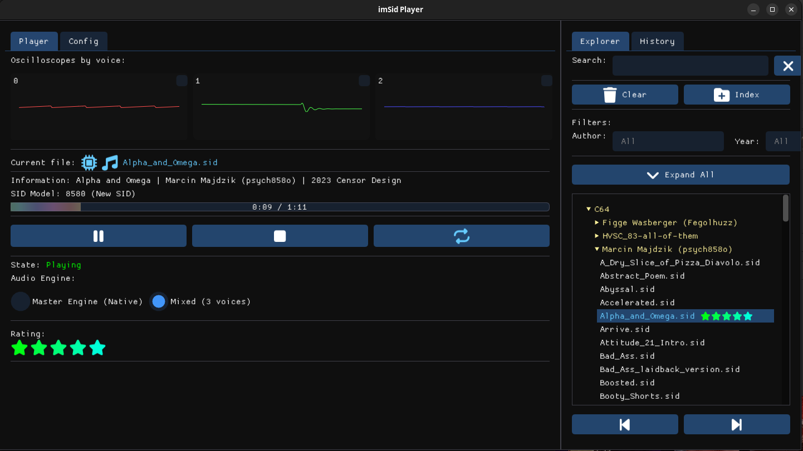

# imSid Player

**Alpha - Work In Progress**

A SID file (Commodore 64) player for Linux and Windows with a modern graphical interface using ImGui.



## Download

📦 **[Download latest release](https://github.com/secharvet/imsidplayer/releases/latest)**

> **Built from source on GitHub CI** - All releases are automatically built from public source code using GitHub Actions. SHA256 hashes are available in the release assets for verification.

### ⚠️ Windows SmartScreen Warning

**imSidPlayer is an unsigned indie executable.** 

To run it:
1. Click **"More info"**
2. Click **"Run anyway"**

Source code is public and reproducible via GitHub Actions. Enjoy! 🎵

## Features

- 🎵 **SID Playback** - High-quality playback with automatic SID model detection (6581/8580)
- 🎛️ **Voice Analysis** - 3 parallel engines with individual voice control and real-time oscilloscopes
- 📚 **Smart Library** - Automatic metadata indexing with fuzzy search and filters (author, year)
- 🎨 **Customizable UI** - Drag & drop background images, hierarchical playlist management
- 💾 **Auto-Save** - Configuration, playlist, and preferences automatically saved

## Quick Start

### Prerequisites

```bash
# Ubuntu/Debian
sudo apt-get install -y build-essential cmake libsdl2-dev libsdl2-image-dev libsidplayfp-dev pkg-config
```

### Build

```bash
mkdir build && cd build
cmake ..
make -j$(nproc)
./bin/imSidPlayer
```

## Configuration

Configuration files are stored in `~/.imsidplayer/`:
- `config.txt` - Application settings
- `background/` - Background images directory
- `database.json` - SID metadata library

You can drag & drop images anywhere in the application to add them to the background library.

## Technical Details

### Multi-engine Architecture

The player uses 3 parallel SID engines for voice isolation:
- Each engine analyzes one voice while muting the others
- Audio is manually mixed from the 3 engines
- All engines play synchronously, even when muted (for oscilloscope analysis)

### Dependencies

- **ImGui** - GUI framework (git submodule)
- **SDL2** - Window and audio
- **SDL2_image** - Image loading
- **sidplayfp** - SID file playback
- **Glaze** - JSON serialization for metadata database

## License

This project uses:
- **ImGui** : MIT License
- **SDL2** : zlib License
- **SDL2_image** : zlib License
- **sidplayfp** : GPL v2+
