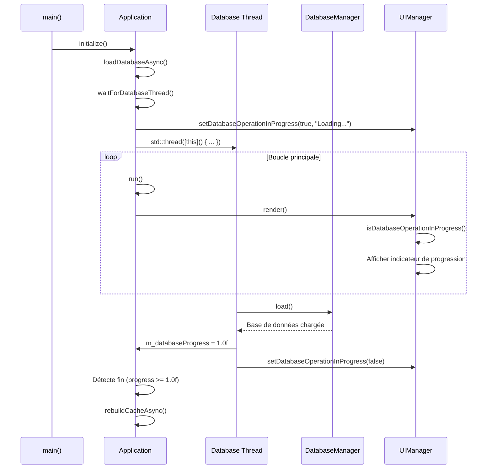
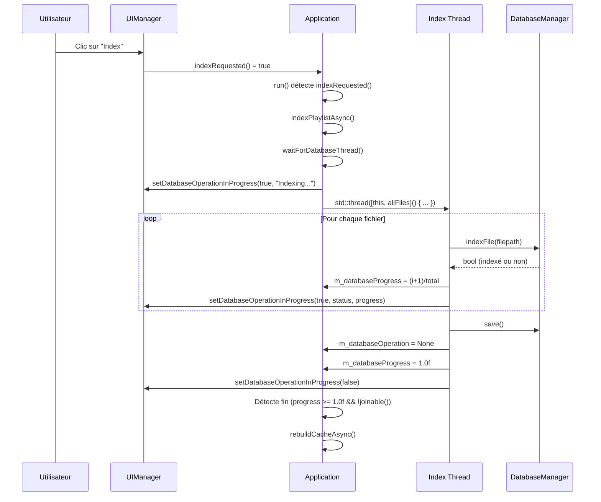
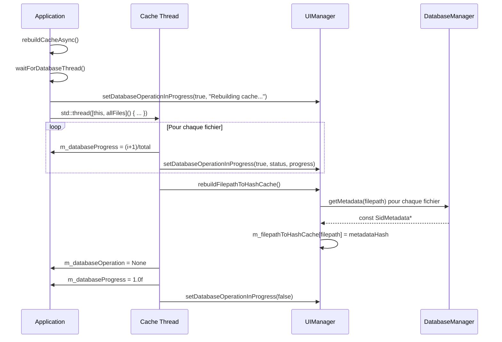
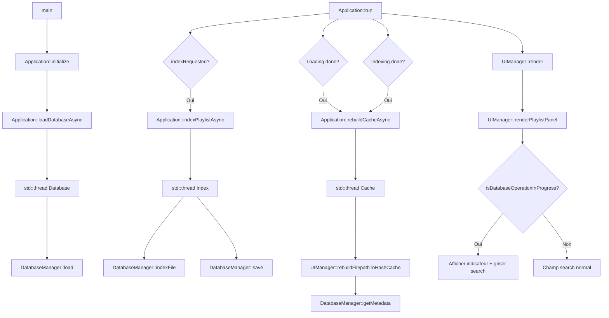
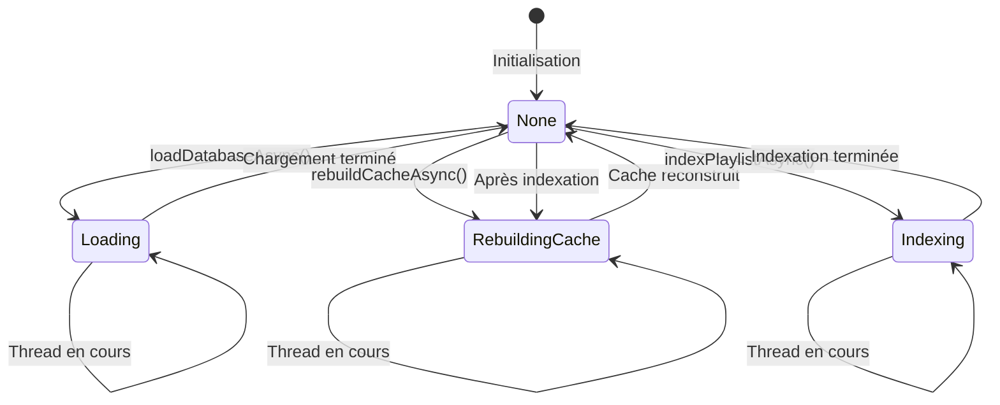

# Documentation Multithreading - imSid Player

> **Note d'affichage** :** Pour une meilleure lisibilité dans Obsidian, désactivez la largeur limitée dans `Paramètres → Apparence → Largeur maximale du contenu` ou utilisez le mode "Lecture" (`Ctrl+E`).

## Vue d'ensemble

Le système de multithreading dans imSid Player permet d'exécuter les opérations longues (chargement de base de données, indexation, reconstruction de cache) dans des threads séparés pour éviter de bloquer l'interface utilisateur.

## Architecture

### Composants principaux

#### 1. Application (`include/Application.h`, `src/Application.cpp`)

La classe `Application` gère tous les threads de base de données via :

- **Enum `DatabaseOperation`** : État de l'opération en cours
  ```cpp
  enum class DatabaseOperation {
      None,           // Aucune opération
      Loading,        // Chargement de la base de données
      Indexing,       // Indexation de la playlist
      RebuildingCache // Reconstruction du cache filepath → hash
  };
  ```

- **Variables atomiques** : Synchronisation thread-safe
  ```cpp
  std::atomic<DatabaseOperation> m_databaseOperation;
  std::atomic<float> m_databaseProgress;
  std::atomic<int> m_databaseCurrent;
  std::atomic<int> m_databaseTotal;
  ```

- **Mutex** : Protection des messages de statut
  ```cpp
  mutable std::mutex m_databaseStatusMutex;
  mutable std::string m_databaseStatusMessage;
  ```

- **Thread** : Exécution des opérations longues
  ```cpp
  std::thread m_databaseThread;
  std::atomic<bool> m_shouldStopDatabaseThread;
  ```

#### 2. UIManager (`include/UIManager.h`, `src/UIManager.cpp`)

L'interface utilisateur reçoit les mises à jour de progression via :

```cpp
void setDatabaseOperationInProgress(bool inProgress, const std::string& status = "", float progress = 0.0f);
bool isDatabaseOperationInProgress() const;
std::string getDatabaseOperationStatus() const;
float getDatabaseOperationProgress() const;
```

## Flux d'exécution

### 1. Chargement de la base de données au démarrage



**Références au code** :
- Initialisation : `Application::initialize()` ligne 56-70 dans `src/Application.cpp`
- Lancement du thread : `Application::loadDatabaseAsync()` ligne 322-350
- Détection de fin : `Application::run()` ligne 214-230

### 2. Indexation de la playlist



**Références au code** :
- Détection de la demande : `Application::run()` ligne 207-212
- Lancement du thread : `Application::indexPlaylistAsync()` ligne 352-415
- Boucle d'indexation : `Application::indexPlaylistAsync()` ligne 373-396

### 3. Reconstruction du cache



**Références au code** :
- Lancement : `Application::rebuildCacheAsync()` ligne 417-467
- Reconstruction : `UIManager::rebuildFilepathToHashCache()` ligne 829-856

## Call Graph

### Vue d'ensemble du système



## Synchronisation

### Protection des ressources partagées

1. **Variables atomiques** : Pour les valeurs numériques partagées
   - `m_databaseOperation` : État de l'opération
   - `m_databaseProgress` : Progression (0.0 à 1.0)
   - `m_databaseCurrent` / `m_databaseTotal` : Compteurs

2. **Mutex** : Pour les chaînes de caractères
   - `m_databaseStatusMutex` : Protège `m_databaseStatusMessage`

3. **Pas de mutex nécessaire** : Pour les variables UI simples
   - `m_databaseOperationInProgress` (bool)
   - `m_databaseOperationStatus` (string, écriture depuis un seul thread)
   - `m_databaseOperationProgress` (float)

### Gestion de l'arrêt propre

```cpp
void Application::waitForDatabaseThread() {
    if (m_databaseThread.joinable()) {
        m_shouldStopDatabaseThread = true;  // Signal d'arrêt
        m_databaseThread.join();            // Attendre la fin
        m_shouldStopDatabaseThread = false; // Reset
    }
}
```

**Référence** : `Application::waitForDatabaseThread()` ligne 469-475

Les threads vérifient régulièrement `m_shouldStopDatabaseThread` pour s'arrêter proprement :

```cpp
for (size_t i = 0; i < allFiles.size(); ++i) {
    if (m_shouldStopDatabaseThread.load()) break;  // Arrêt demandé
    // ... traitement ...
}
```

## Interface utilisateur

### Grisage du champ de recherche

Quand une opération est en cours, le champ de recherche est grisé et un indicateur de progression est affiché :

```cpp
bool dbOperationInProgress = isDatabaseOperationInProgress();
if (dbOperationInProgress) {
    ImGui::PushStyleVar(ImGuiStyleVar_Alpha, ImGui::GetStyle().Alpha * 0.5f);
}

ImGui::InputText("##search", searchBuffer, sizeof(searchBuffer), 
                dbOperationInProgress ? ImGuiInputTextFlags_ReadOnly : 0);

if (dbOperationInProgress) {
    ImGui::PopStyleVar();
    // Afficher indicateur de progression
    float progress = getDatabaseOperationProgress();
    std::string status = getDatabaseOperationStatus();
    ImGui::TextColored(ImVec4(1.0f, 1.0f, 0.0f, 1.0f), " %s", status.c_str());
    if (progress > 0.0f && progress < 1.0f) {
        ImGui::ProgressBar(progress, ImVec2(0, 0), "");
    }
}
```

**Référence** : `UIManager::renderPlaylistPanel()` ligne 496-520 dans `src/UIManager.cpp`

## Points d'attention

### 1. Éviter les deadlocks

**Problème résolu** : Ne jamais appeler `rebuildCacheAsync()` depuis un thread de travail. Le thread principal détecte la fin et lance le rebuild.

```cpp
// ❌ MAUVAIS (dans le thread d'indexation)
rebuildCacheAsync();  // Crée un deadlock !

// ✅ BON (dans le thread principal)
if (m_databaseProgress.load() >= 1.0f && !m_databaseThread.joinable()) {
    rebuildCacheAsync();  // Sécurisé
}
```

**Référence** : `Application::run()` ligne 232-243

### 2. Détection de fin de thread

La détection se fait via :
- `m_databaseProgress >= 1.0f` : Indique que le traitement est terminé
- `!m_databaseThread.joinable()` : Indique que le thread s'est terminé (ou vérification avec `join()`)

### 3. Mise à jour de l'UI depuis les threads

Les mises à jour de l'UI depuis les threads sont thread-safe car :
- `setDatabaseOperationInProgress()` ne verrouille pas de mutex
- Les variables sont simples (bool, string, float)
- L'écriture se fait depuis un seul thread à la fois

## Diagramme d'état



## Résumé des fichiers modifiés

| Fichier | Lignes clés | Description |
|---------|-------------|-------------|
| `include/Application.h` | 15-86 | Déclaration des variables de threading |
| `src/Application.cpp` | 214-243 | Détection de fin d'opérations dans `run()` |
| `src/Application.cpp` | 322-350 | `loadDatabaseAsync()` |
| `src/Application.cpp` | 352-415 | `indexPlaylistAsync()` |
| `src/Application.cpp` | 417-467 | `rebuildCacheAsync()` |
| `src/Application.cpp` | 469-475 | `waitForDatabaseThread()` |
| `include/UIManager.h` | 38-43 | Méthodes de gestion d'état DB |
| `src/UIManager.cpp` | 496-520 | Grisage du champ de recherche |
| `src/UIManager.cpp` | 823-827 | `setDatabaseOperationInProgress()` |
| `src/UIManager.cpp` | 829-856 | `rebuildFilepathToHashCache()` |

## Notes de performance

- **Chargement DB** : Généralement < 100ms pour ~60k fichiers
- **Indexation** : ~1-2ms par fichier (dépend de la taille)
- **Rebuild cache** : ~67ms pour ~60k fichiers (mesuré)

Les opérations sont asynchrones, donc l'UI reste réactive même avec de grandes bases de données.

