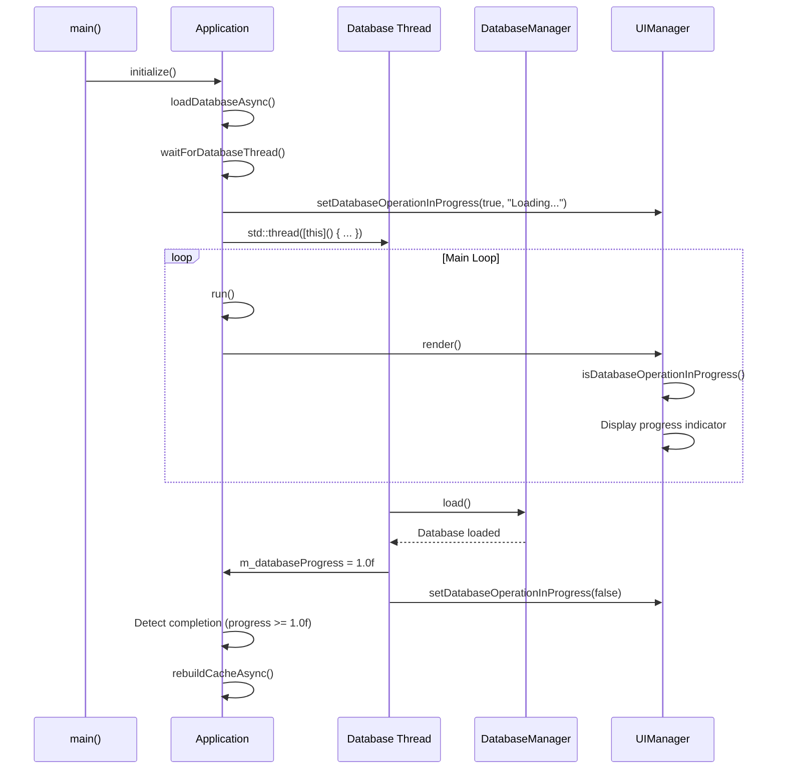
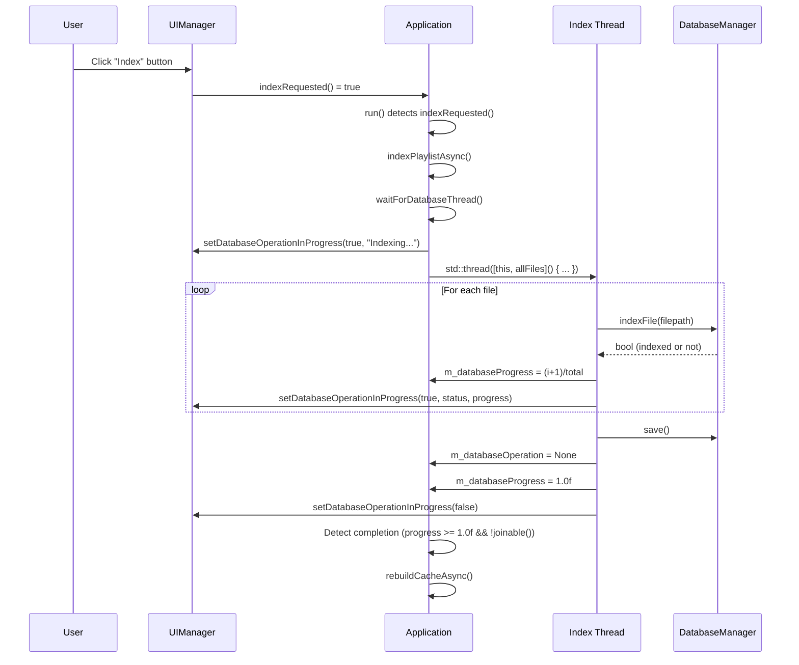
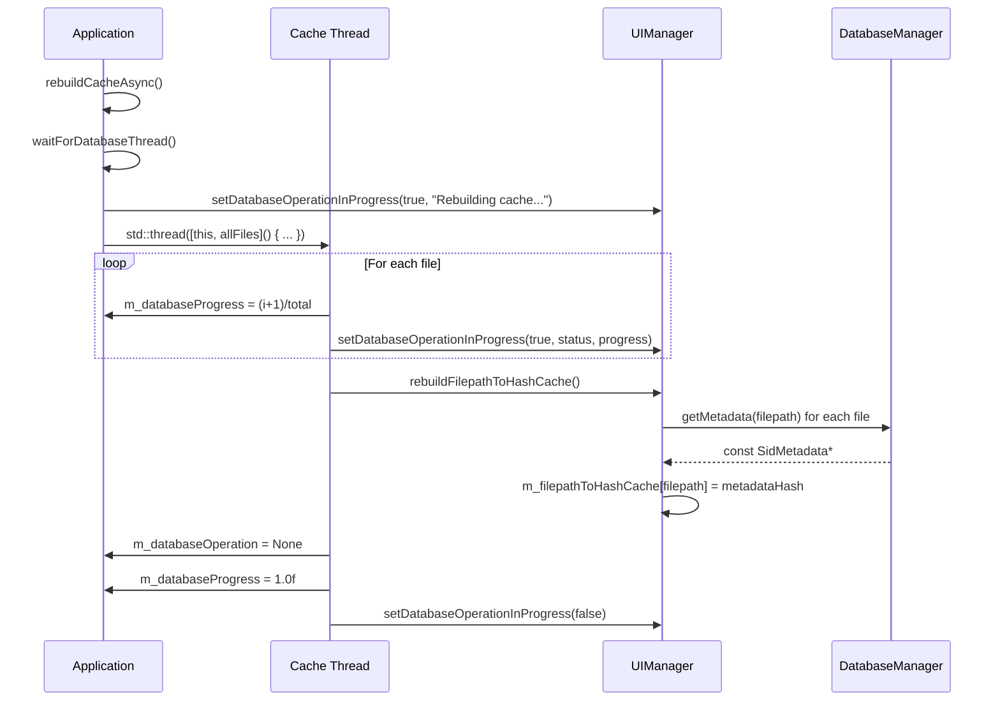
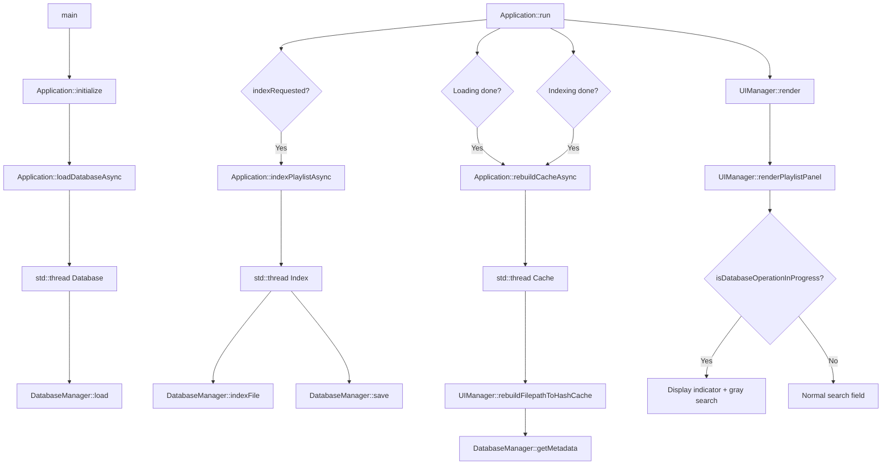
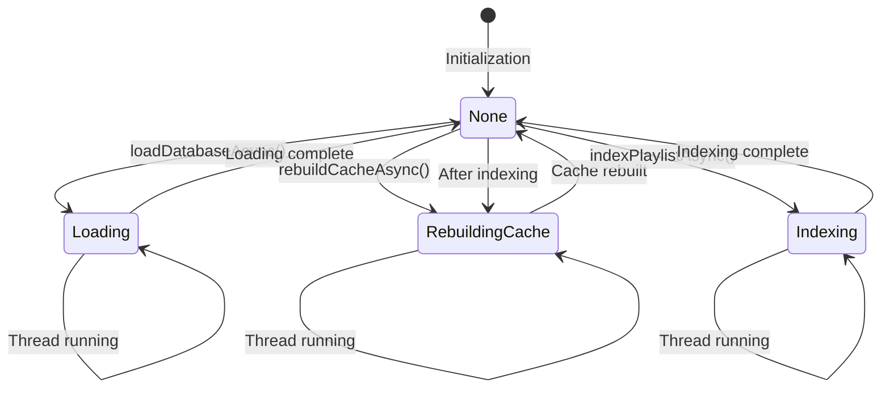

# Multithreading Documentation - imSid Player

> **Display Note:** For better readability in Obsidian, disable the content width limit in `Settings → Appearance → Maximum content width` or use "Reading mode" (`Ctrl+E`).

## Overview

The multithreading system in imSid Player allows long-running operations (database loading, indexing, cache rebuilding) to execute in separate threads to avoid blocking the user interface.

## Architecture

### Main Components

#### 1. Application (`include/Application.h`, `src/Application.cpp`)

The `Application` class manages all database threads via:

- **Enum `DatabaseOperation`**: Current operation state
  ```cpp
  enum class DatabaseOperation {
      None,           // No operation
      Loading,        // Database loading
      Indexing,       // Playlist indexing
      RebuildingCache // Rebuilding filepath → hash cache
  };
  ```

- **Atomic variables**: Thread-safe synchronization
  ```cpp
  std::atomic<DatabaseOperation> m_databaseOperation;
  std::atomic<float> m_databaseProgress;
  std::atomic<int> m_databaseCurrent;
  std::atomic<int> m_databaseTotal;
  ```

- **Mutex**: Status message protection
  ```cpp
  mutable std::mutex m_databaseStatusMutex;
  mutable std::string m_databaseStatusMessage;
  ```

- **Thread**: Long operation execution
  ```cpp
  std::thread m_databaseThread;
  std::atomic<bool> m_shouldStopDatabaseThread;
  ```

#### 2. UIManager (`include/UIManager.h`, `src/UIManager.cpp`)

The user interface receives progress updates via:

```cpp
void setDatabaseOperationInProgress(bool inProgress, const std::string& status = "", float progress = 0.0f);
bool isDatabaseOperationInProgress() const;
std::string getDatabaseOperationStatus() const;
float getDatabaseOperationProgress() const;
```

## Execution Flow

### 1. Database Loading at Startup



**Code references**:
- Initialization: `Application::initialize()` line 56-70 in `src/Application.cpp`
- Thread launch: `Application::loadDatabaseAsync()` line 322-350
- Completion detection: `Application::run()` line 214-230

### 2. Playlist Indexing



**Code references**:
- Request detection: `Application::run()` line 207-212
- Thread launch: `Application::indexPlaylistAsync()` line 352-415
- Indexing loop: `Application::indexPlaylistAsync()` line 373-396

### 3. Cache Rebuilding



**Code references**:
- Launch: `Application::rebuildCacheAsync()` line 417-467
- Rebuilding: `UIManager::rebuildFilepathToHashCache()` line 829-856

## Call Graph

### System Overview



## Synchronization

### Shared Resource Protection

1. **Atomic variables**: For shared numeric values
   - `m_databaseOperation`: Operation state
   - `m_databaseProgress`: Progress (0.0 to 1.0)
   - `m_databaseCurrent` / `m_databaseTotal`: Counters

2. **Mutex**: For character strings
   - `m_databaseStatusMutex`: Protects `m_databaseStatusMessage`

3. **No mutex needed**: For simple UI variables
   - `m_databaseOperationInProgress` (bool)
   - `m_databaseOperationStatus` (string, written from single thread)
   - `m_databaseOperationProgress` (float)

### Clean Shutdown Management

```cpp
void Application::waitForDatabaseThread() {
    if (m_databaseThread.joinable()) {
        m_shouldStopDatabaseThread = true;  // Stop signal
        m_databaseThread.join();            // Wait for completion
        m_shouldStopDatabaseThread = false; // Reset
    }
}
```

**Reference**: `Application::waitForDatabaseThread()` line 469-475

Threads regularly check `m_shouldStopDatabaseThread` for clean shutdown:

```cpp
for (size_t i = 0; i < allFiles.size(); ++i) {
    if (m_shouldStopDatabaseThread.load()) break;  // Stop requested
    // ... processing ...
}
```

## User Interface

### Search Field Graying

When an operation is in progress, the search field is grayed out and a progress indicator is displayed:

```cpp
bool dbOperationInProgress = isDatabaseOperationInProgress();
if (dbOperationInProgress) {
    ImGui::PushStyleVar(ImGuiStyleVar_Alpha, ImGui::GetStyle().Alpha * 0.5f);
}

ImGui::InputText("##search", searchBuffer, sizeof(searchBuffer), 
                dbOperationInProgress ? ImGuiInputTextFlags_ReadOnly : 0);

if (dbOperationInProgress) {
    ImGui::PopStyleVar();
    // Display progress indicator
    float progress = getDatabaseOperationProgress();
    std::string status = getDatabaseOperationStatus();
    ImGui::TextColored(ImVec4(1.0f, 1.0f, 0.0f, 1.0f), " %s", status.c_str());
    if (progress > 0.0f && progress < 1.0f) {
        ImGui::ProgressBar(progress, ImVec2(0, 0), "");
    }
}
```

**Reference**: `UIManager::renderPlaylistPanel()` line 496-520 in `src/UIManager.cpp`

## Important Considerations

### 1. Avoiding Deadlocks

**Resolved issue**: Never call `rebuildCacheAsync()` from a worker thread. The main thread detects completion and launches the rebuild.

```cpp
// ❌ BAD (in indexing thread)
rebuildCacheAsync();  // Creates a deadlock!

// ✅ GOOD (in main thread)
if (m_databaseProgress.load() >= 1.0f && !m_databaseThread.joinable()) {
    rebuildCacheAsync();  // Safe
}
```

**Reference**: `Application::run()` line 232-243

### 2. Thread Completion Detection

Detection is done via:
- `m_databaseProgress >= 1.0f`: Indicates processing is complete
- `!m_databaseThread.joinable()`: Indicates thread has finished (or check with `join()`)

### 3. UI Updates from Threads

UI updates from threads are thread-safe because:
- `setDatabaseOperationInProgress()` doesn't lock any mutex
- Variables are simple (bool, string, float)
- Writing is done from a single thread at a time

## State Diagram



## Modified Files Summary

| File | Key Lines | Description |
|------|-----------|-------------|
| `include/Application.h` | 15-86 | Threading variable declarations |
| `src/Application.cpp` | 214-243 | Operation completion detection in `run()` |
| `src/Application.cpp` | 322-350 | `loadDatabaseAsync()` |
| `src/Application.cpp` | 352-415 | `indexPlaylistAsync()` |
| `src/Application.cpp` | 417-467 | `rebuildCacheAsync()` |
| `src/Application.cpp` | 469-475 | `waitForDatabaseThread()` |
| `include/UIManager.h` | 38-43 | DB state management methods |
| `src/UIManager.cpp` | 496-520 | Search field graying |
| `src/UIManager.cpp` | 823-827 | `setDatabaseOperationInProgress()` |
| `src/UIManager.cpp` | 829-856 | `rebuildFilepathToHashCache()` |

## Performance Notes

- **DB Loading**: Generally < 100ms for ~60k files
- **Indexing**: ~1-2ms per file (depends on size)
- **Cache Rebuild**: ~67ms for ~60k files (measured)

Operations are asynchronous, so the UI remains responsive even with large databases.

